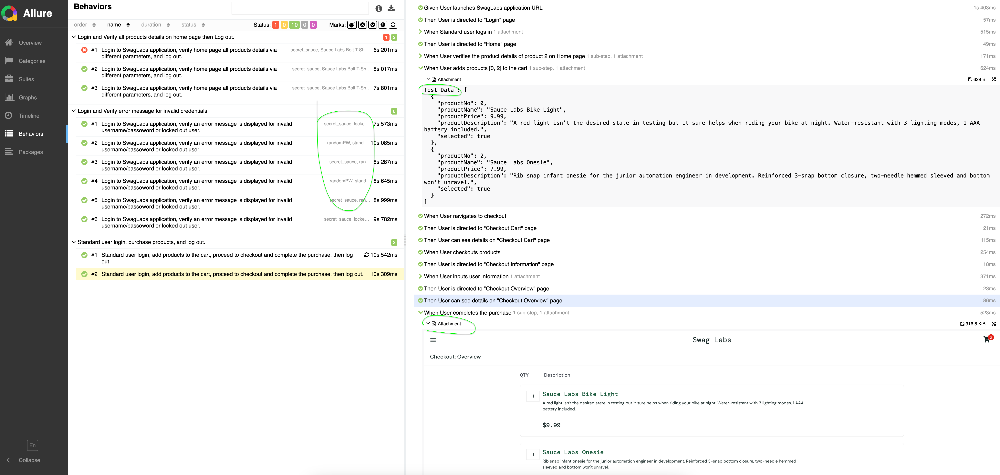
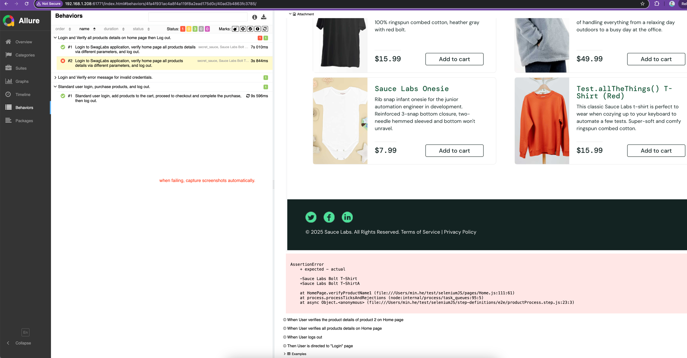
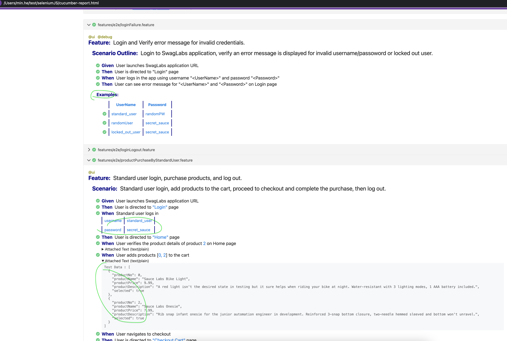

<h1> Selenium Webdriver Automation Framework with CucumberJS & Allure Reporting</h1>
<p>This repository contains an automation framework built using <strong>Selenium Webdriver</strong>, <strong>JavaScript (ESM)</strong>, <strong>CucumberJS</strong>, and <strong>Allure reporting</strong> for <strong>E2E </strong> testing web applications.</p>

<p>This project current purpose is for skills demonstration. Play Selenium with Cucumber(BDD) which is using cucumber runner, covering passing test data via different ways: cucumber step argument, data table, csv file; support dynamic page creation, dynamic getLocators.

## Project Structure:
```
├── configs --- test runner configuration and test env configuration files.
├── data  --- test data files.
├── features
├── pages
└── step-definitions
│ ├── support  --- hooks
├── .env --- selenium webdriver configuration file.
```
 </p>

<h2> Notes for test scenarios </h2>
<h3> Browser (UI) Tests - https://www.saucedemo.com </h3>
<h4>Scenario1 - Login Test: Validate that a user can log in successfully with valid credentials
and that an error message is displayed for invalid credentials by iterations.</h4>

<h4>Scenario2 - Product Purchase Test: Validate the end-to-end purchase process:</h4>
<ul>
Log in -> Add a product to the cart. -> Proceed to checkout and complete the purchase. -> Log out.
</ul>


<h2> Prerequisites </h2>
<p>Ensure that you have the following installed:</p>
    <p> Node.js (version >=14) </p>
    <p> npm is recommended </p>


<h2> Setup </h2>
<h3> 1. Clone the Repository and Install Dependencies </h3>
Run the following command to install all the required dependencies:
    npm install

<h3> 2. Configuration </h3>
Cucumber Configuration (cucumber.mjs): This file contains configurations specific to Cucumber, such as the location of feature files and the step definition files.

<h3> 3. Configure Allure Reporting</h3>
To generate Allure reports after the tests run, make sure you <strong>have Allure installed globally</strong> or you can install it via npm install -g allure-commandline.

<h3> 4. Running Tests</h3>
You can run your tests using the following commands:

    npm run test
*This will:
    Run the <strong>E2E</strong> tests.
    Generate the Allure report results inside the allure-results/ directory.

    npm run test:local
*This will:
    Run the <strong>E2E</strong> tests.
    Generate the cucumber html report results with console progress information, cucumber-report.html inside the project root directory.

     npm run test:local -- --tags @debug   
*This will:
    Run the <strong>E2E</strong> tests with <strong>tag - @debug</strong> only.
    Generate the cucumber html report results with console progress information, cucumber-report.html inside the project root directory.


<h3> 5. Viewing the Allure Report (Optional) </h3>
After running the tests, you can generate and view the Allure report by running the following command:
    npm run report
This will open a web server and display the Allure report in your browser.


<h2> Screenshots </h2>

### [Passed Allure Result](screenshots/selenium-pass-allure.png)



### [Failed Allure Result](screenshots/selenium-fail-allure.png)



### [Cucumber HTML Result](screenshots/selenium-cucumber.png)



More snapshots could be found under screenshots folder for more reference.
